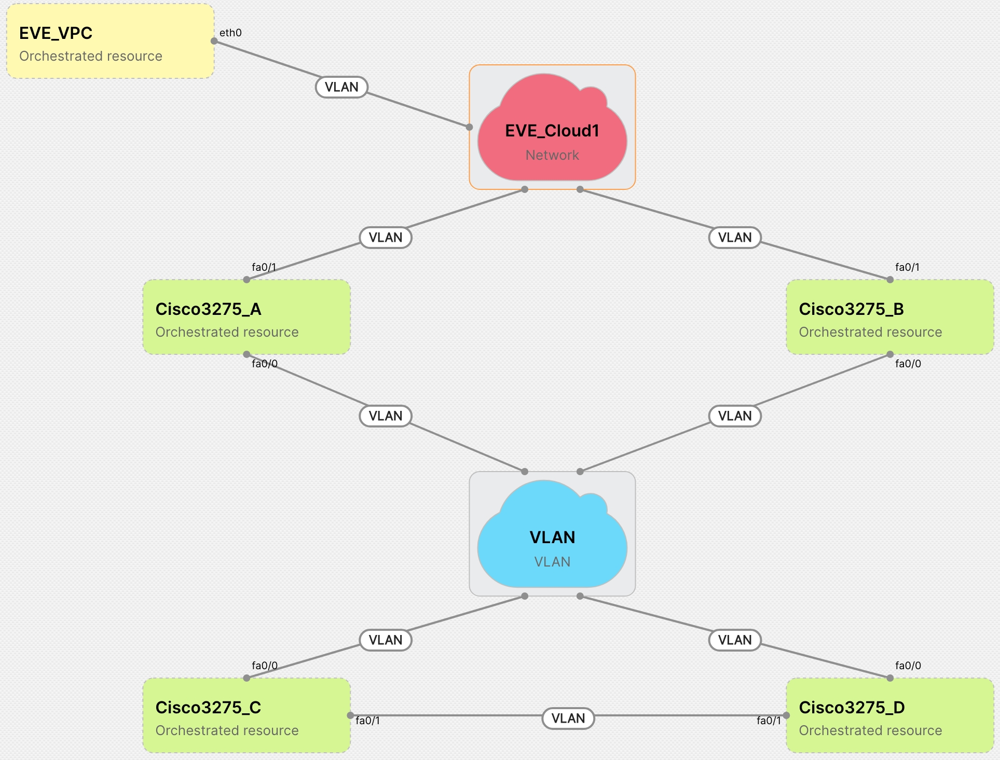

### Project Information:
Project: EveNG Instance Driver  
Description: EveNG instance driver that utilizes the orchestrated interface to instantiate new EveNG topologies dynamically, that reflect the Velocity one created  
Category: driver    
Class: Community    
  
### Abstract:  
  
This is an orchestration driver used deploy dynamically Velocity topologies in an EveNG server. 

This driver is meant to be used in conjunction with the EveNG L2 driver (ri_EvengL2Dyn), and provided templates, so the installation instructions are written assuming that both the switch driver and the instance driver are being used in tandem.  

  
### Installation:  
    
Upload the EveNG instance driver zip to Velocity via "Library / Drivers / Add" and name it something like "EveNgDyn"  

Upload the EveNG L2 driver zip to Velocity via "Library / Drivers / Add" and name it something like "EveNgL2Dyn"  

Import the templates from the zip file located in the instance driver (EVENG_template.zip)

Create a template inherited from the instance one inherited (EVENG_Dyn) for each of the nodes available in EveNG. Those fields must be fulfilled:

Group Cluster:
- ClusterIP: EevNG cluster IP
- ClusterUsername: Cluster login credentials (username).
- ClusterPassword: Cluster login credentials (password).

Group Template Body
- template: EveNG template to use (e.g. c3725). Template won't be created in EveNG, it must exist already.
- type: Node type (e.g dynamips)
- image: Firmware image (e.g. c3725-adventerprisek9-mz.124-15.T14.image). Firmware won't be uploaded to EveNG, it must exist already.
- icon: Icon to be used in EveNG topology (e.g. Router.png). Icon won't be uploaded to EveNG, it must exist already.
- idlepc: Idle-pc to be configured. Select one of the values offered in EveNG for that architecture/type (e.g. 0x60c08728)
- nvram: nvram assigned to this node (e.g. 128)
- ram: ram assigned to this node (e.g. 256)
- slot1: What is in slot 1 if applicable (e.g. Empty)
- slot2: What is in slot 2 if applicable (e.g. Empty)
- config: Config to be loaded (0=no custom config should be loaded, 1=load saved configuration, string=config to load)
- delay: Delqy to start the node in seconds (e.g. 0)
- left: Left coordinate to place he node in EveNG topology canvas (e.g. 0). nodes can overlap in EveNG visualization with no consequences.
- top: Top coordinate to place he node in EveNG topology canvas (e.g. 0). nodes can overlap in EveNG visualization with no consequences.
- postfix: Additional command to be send to QEMU when node is tarted.

EveNG only allow one session from a single user/pass. That means that the credential used for Velocity must not be used in any other context, as if someone login while velocity is configuring an environment, it will kick our Velocity and so topology instantiation will fail.
Added to that, Velocity can work in parallel with multiple agents, to deploy several nodes in parallel and speedup the topology deployment. It will cause the same problem as single login session. To solve that, templates restrict agents to those with capabilities "unique: eveng". this must be set in only one agent as a restriction.

EveNG instance driver is linked to EveNG L2 driver.  A resource based on template EVE_NG_L2, using driver ri_evengL2Dyn must be created. Only ipAddress, username and password properties are required, with the right ones to log into EveNG cluster.

# Networking

Taking this topology as example

 

When connecting nodes, regular VLAN links or cloud can be used (Links and blue network in the example). 

When connected nodes into external network (purple network), a network with a custom argument named EVE_Network must be used. This argument will contain the port name in EveNG cluster to use to connect to.

