### Project Information:
Project: VMware Networking Driver  
Description: L2 switch driver that creates vSwitches in VMware used to interconnect instances, optional support for VMware Distributed Switch (VDS) or Distributed Virtual Switch (DVS).  
Category: driver    
Class: Community    
  
### Abstract:  
  
This is an L2 switch driver for VMware that creates either a Standard Virtual Switch or a Distributed Virtual Switch based on the setting of the vSwitchIsDVS property. It's used to connect VMs created by the VMware Instance Driver available at https://developer.spirent.com and is called by Velocity after all VM instances are created.   
  
This driver is meant to be used in conjunction with the VMware Instance Driver, so the installation instructions are written assuming that both the switch driver and the instance driver are being used in tandem.  
  
The agent running this driver needs the pyvmomi python library installed and usable by the "velagent" user (the user-id running the Velocity agent process). To prepare the agent(s) to run this driver, follow the installation instructions at http://vmware.github.io/pyvmomi-community-samples and it's recommended to set the capabilities on that driver to distinguish it for this purpose. For example, a good practice would be to set this driver with capabilities like pool=orch-driver and cloud=vmware.  
  
  
### Installation:  
    
Upload the "vSphere vSwitch" driver iTar to Velocity via "Libary / Drivers / Add" and name it something like "VMware L2 Switch Driver 2.0.0"  
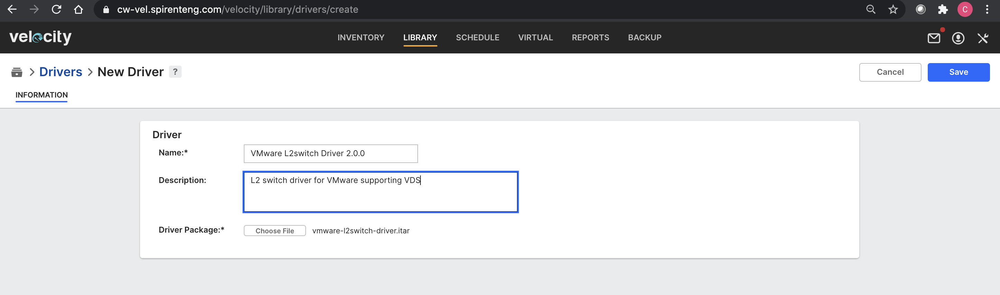  
  
Create the "vSphere vSwitch" template by running vmware-l2switch-driver/model/create_model.fftc, making sure that the parameters are set appropriately. When running the script, iTest will prompt for the password.  
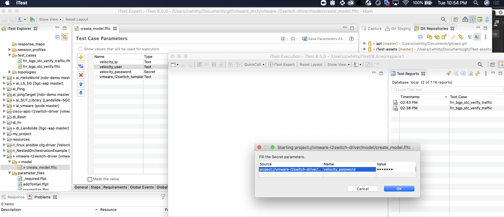  
  
This will add the template right into Velocity under "Network Element / Layer 2 Switch"  
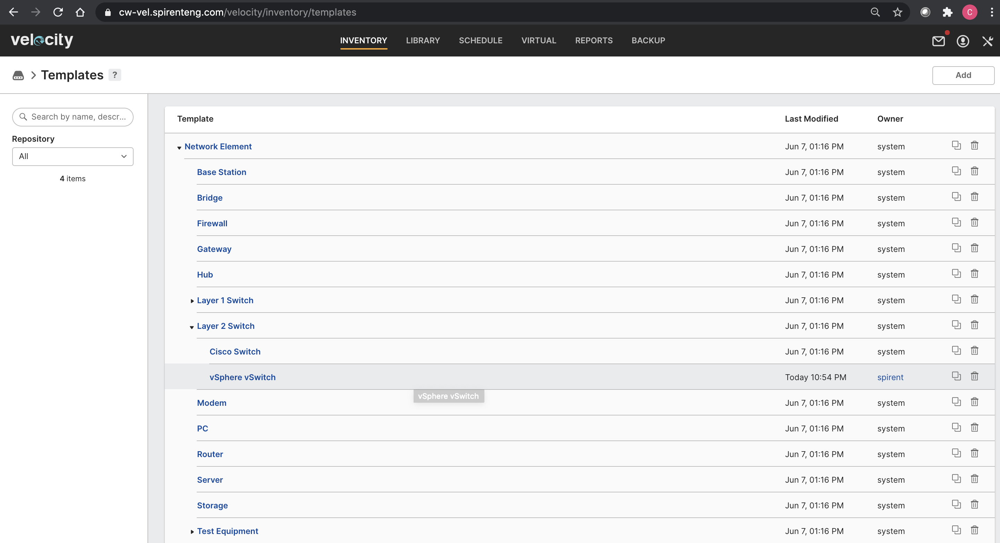  
  
Configure the "vSphere vSwitch" template by setting the driver to "VMware L2 Switch Driver 2.0.0".  
Add specific "Driver Agent Requirements" to the "vSphere vSwitch" template, for example, pool=orch-driver and cloud=vmware. This is important because agents running this automation must be provisioned in advance with pyvmomi libraries to automate VMware. Those agents should be configured with capabilities or restrictions that match these requirements so the automation is dispatched to agents that can orchestrate on VMware.  
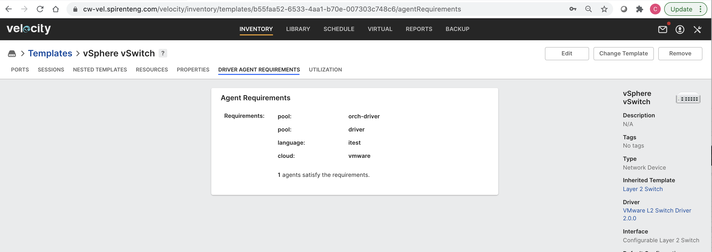  
  
Add a resource representing the vSwitch using the "vSphere vSwitch" template using the "vSphere vSwitch" driver.  
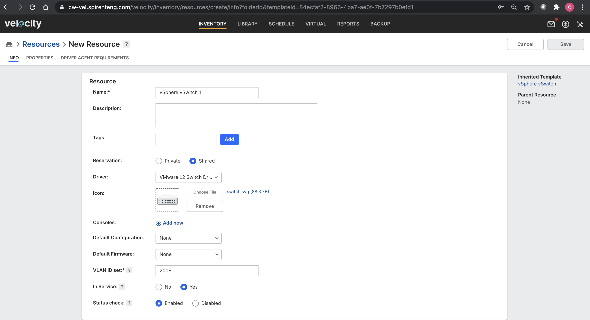  
  
Set the property values of all required properties plus username, password, and ipAddress.  
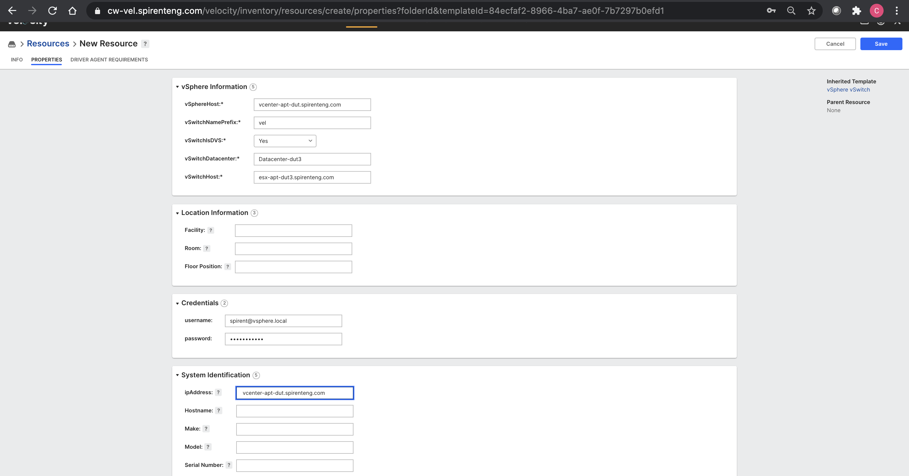  
  
Upload the "VMware Orchestration" driver iTar to Velocity via "Libary / Drivers / Add" and name it something like "VMware Orchestration 1.0.0"  
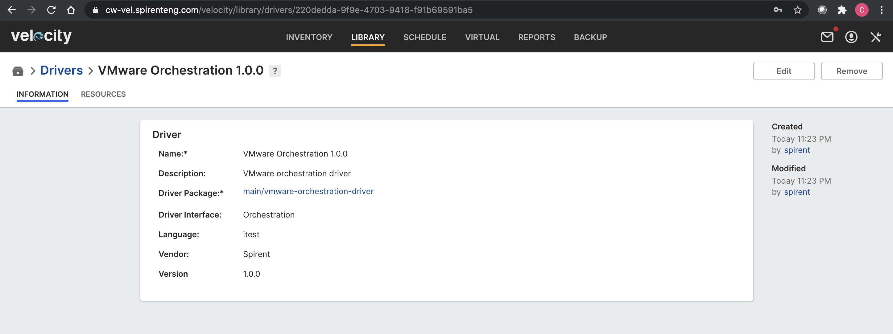  
  
Create the "vSphere Instance Template" template by running vmware-orchestration-driver/model/create_model.fftc, making sure that the parameters are set appropriately. When running the script, iTest will prompt for the password.  
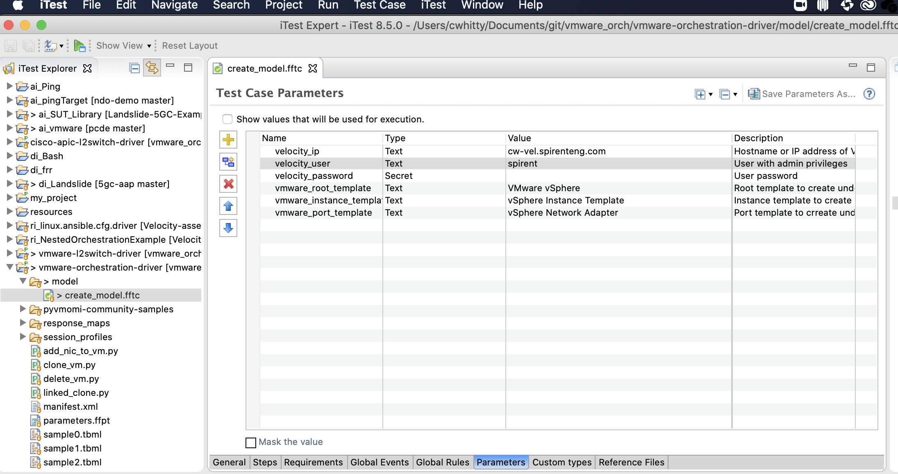  
  
This will add the template right into Velocity under "Orchestrated Resource / VMware vSphere"  
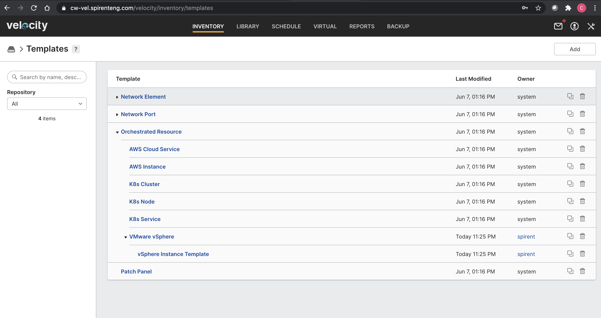  
  
Configure the "vSphere Instance Template" template by setting the driver to "VMware Orchestration 1.0.0" and setting the L2 switch to use (the one created in steps above)  
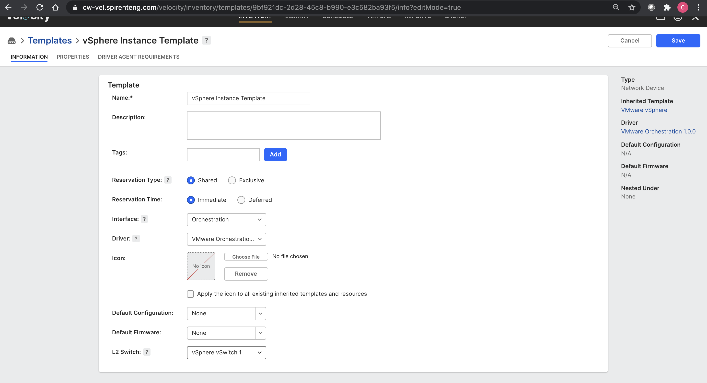  
  
Add specific "Driver Agent Requirements" to the "VMware vSphere" template, for example, pool=orch-driver and cloud=vmware. This is important because agents running this automation must be provisioned in advance with pyvmomi libraries to automate VMware. Those agents should be configured with capabilities or restrictions that match these requirements so the automation is dispatched to agents that can orchestrate on VMware.  
Set property values at the "vSphere Instance Template" level which will be common for its child templates, like which datacenter, cluster, datastore, resource pool, and folder to use for orchestration as well as settings like waiting for IP, cloning from snapshot, and credentials.  
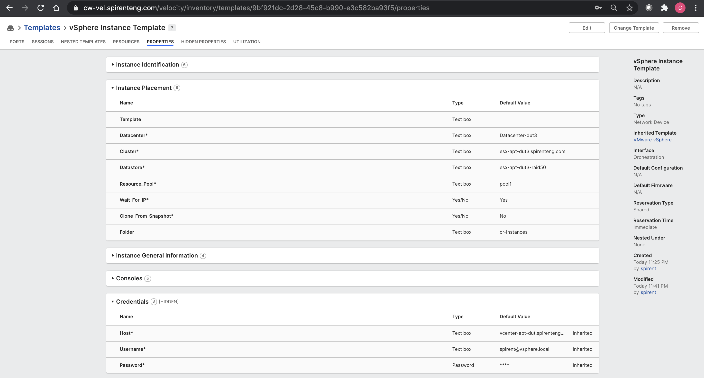  
  
Add a template under "vSphere Instance Template" for each VM that will be orchestrated (an "instance template"). For example, create one for an Ubuntu VM. Ensure that the L2 switch created above is associated with this template.  
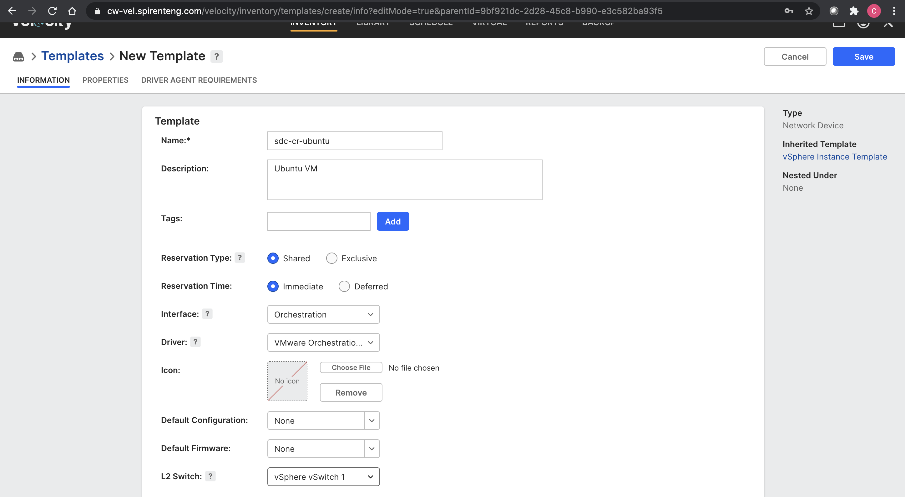  
  
Set VM-specific properties like "Instance Placement / Template" (the VMware template to use for cloning) in this step.  
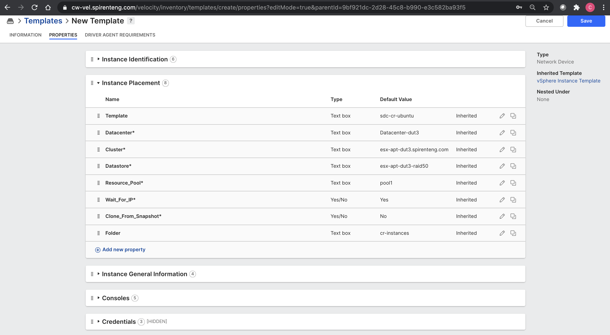  
  
Create a simple orchestrated resource under "Inventory / Orchestrated Resources" using the instance template created above. Set resolving to "Orchestrated Resource" and set the resource group to the group where Velocity should place new VMs made from this orchestrated resource.  
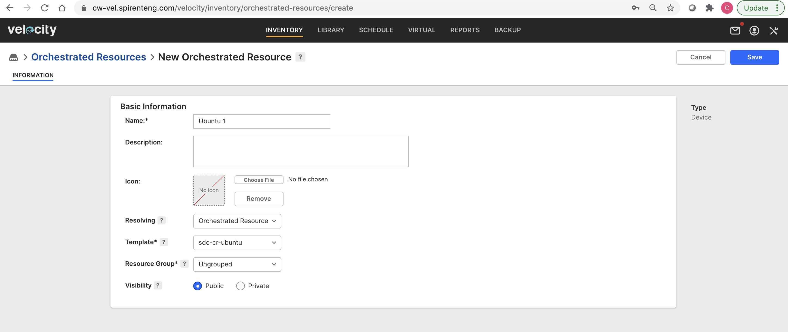  
  
Create a simple topology that contains the orchestrated resource, save, and reserve.   
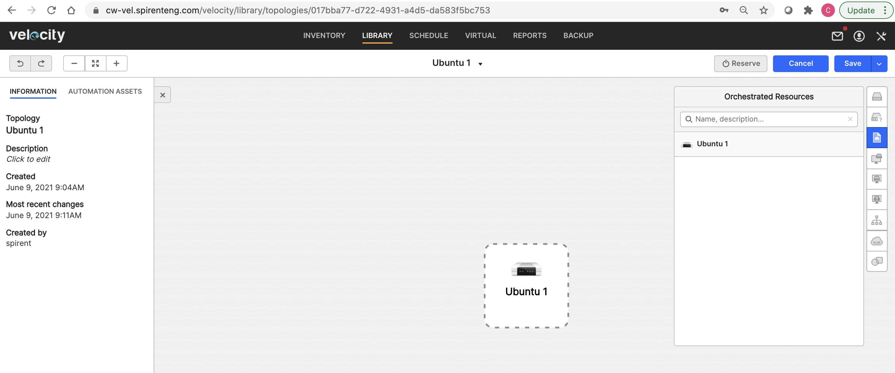  
  
Velocity should create a new VM cloned from the specified template. Select the VM and view its identification in the left-hand panel.  
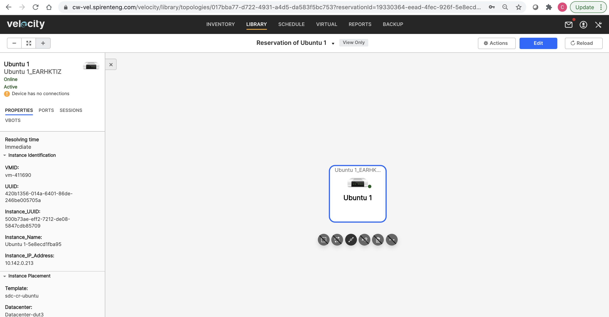  
  
Edit the simple orchestrated resource by adding a nested port called "nic1"  
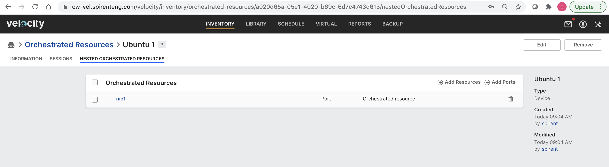  
  
Create another simple topology that contains two of the orchestrated resources and connect them together with a VLAN connection, save, and reserve.  
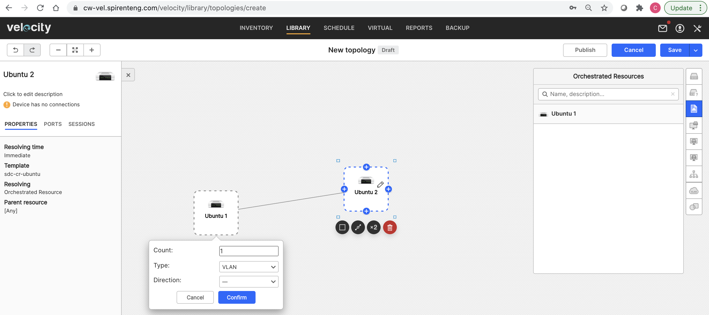  
  
Velocity should create two new VMs cloned from the specified template, create a vSwitch, and attach the VM ports to that vSwitch. At this point, the VMs will have a NIC attached to the management network and another NIC attached to the newly created vSwitch. The VMs should have layer 2 reachability over an un-tagged connection. If the vSwitch resource in Velocity is set for "vSwitchIsDVS = true", the connectivity is made available via a tagged connection using the VLAN assigned to the topology, for example, VLAN 200.   
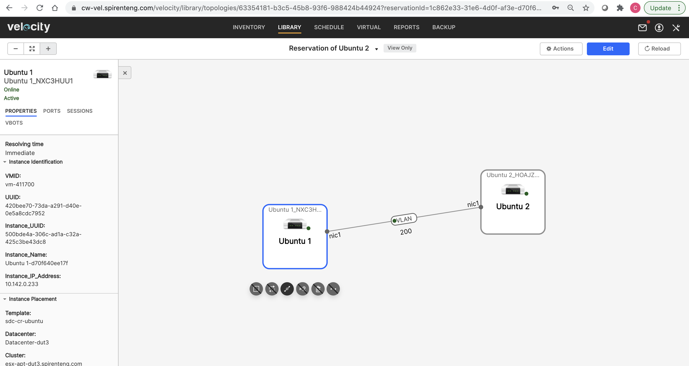  

 ----
2 test cases in project
## Test Case File: vmware-l2switch-driver.fftc
### VMware vSphere L2 Switch Driver
An L2 driver that manages vSwitches, networks and port groups in vSphere. Tested with Python 3.6.5.

To prepare the driver agents to run this, follow instructions in http://vmware.github.io/pyvmomi-community-samples/

Windows: http://vthinkbeyondvm.com/getting-started-with-pyvmomi-on-windows-supports-vsphere-6-7/

VMware object documentation: https://vdc-repo.vmware.com/vmwb-repository/dcr-public/6b586ed2-655c-49d9-9029-bc416323cb22/fa0b429a-a695-4c11-b7d2-2cbc284049dc/doc/left-pane.html

### getPorts
### getProperties
<table><tr><th>Argument</th><th>Description</th></tr>
<tr><td>includePorts</td><tr></tr></table>

### termOrchestratedResource_old
### createVlan
### destroyVlan
### addToVlan
### removeFromVlan
### getUniqueKeyFromReservationId
### getVSwitchName
<table><tr><th>Argument</th><th>Description</th></tr>
<tr><td>vlanId</td><tr></tr></table>

### getNetworkName
<table><tr><th>Argument</th><th>Description</th></tr>
<tr><td>vlanId</td><tr></tr></table>

## Test Case File: create_model.fftc
### Create VMware L2 Switch Driver Model
Creates the necessary template(s) required for the VMware L2 Switch Driver