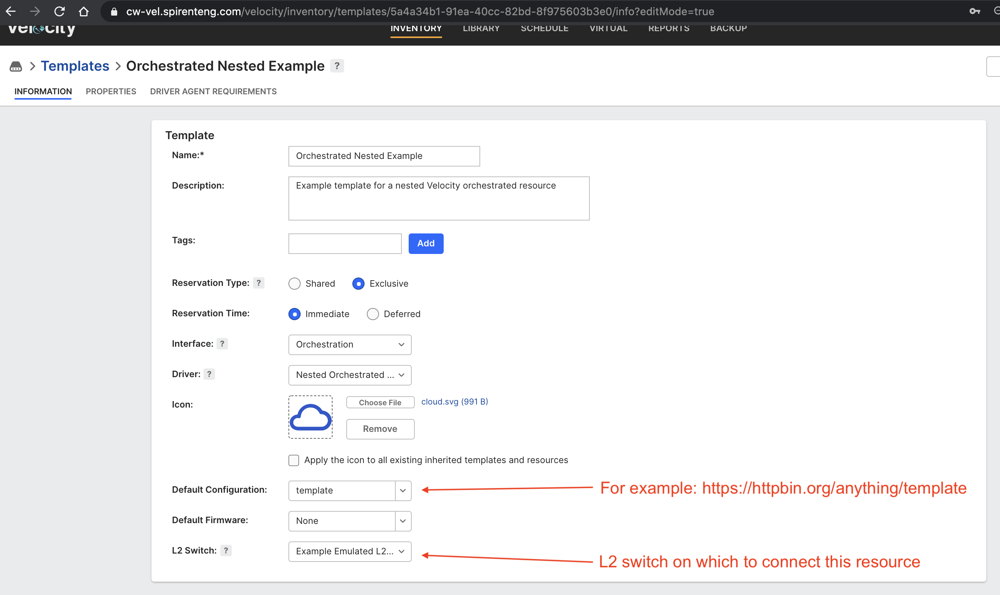

### Project Information:
Project: Velocity Nested Orchestration Examples  
Description: Example nested orchestration driver for orchestrated resources and Velocity selected resources  
Category: driver    
Class: Reference    
    
This is an example orchestration driver. The package contains the manifest file and a single fftc file. You can this as an example to implement orchestrated drivers for other devices (both for existing "Velocity Selected" and ephemeral "Orchestrated" resources).   
    
The driver is to be used with a template of interface type "Orchestration" and requires the following Template properties:    
  
* property_toDriver and ipAddress (The values of these properties will be passed from Velocity to the driver due to its reference in manifest.xml)   
* property_fromDriver (The value of this property will be passed from the driver to Velocity in initOrchestratedResource)   
  
When using this example for orchestrated resources that contain one or more ports, an L2 switch and driver will need to be implemented.   
  
  
  
If you wish, you can import the contents of this package to see the examples. To do this, under Inventory/Resources, import the nested.orch.example.1.zip file followed by the nested.orch.example.2.zip file. Included in the above is the orchestrated driver, an emulated L2 driver, templates, orchestrated resources, and topologies. At the time of this authoring, there were still features being implemented in Velocity to import orchestrated resources, so there are some inconsistencies.  
  
An "orchestrated resource" is one that is created at reservation startup, and that created resource will be placed in a resource group upon instantiation. The examples provided in the zip files place the newly created resource into a resource group called "Group1". So, if using the examples, a resource group called "Group1" must be defined in Velocity in advance.  
  
Orchestrated resources (Velocity selected and Orchestrated) can optionally use configuration management. This is a way for the user to pass instantiation or configuration input in the form of a file or URL as input to the driver. To try out configuration management on orchestrated resources, either use the orchestratedConfig.json file provided, use https://httpbin.org/anything/uri as a custom URI, or create a file store using https://httpbin.org/anything as a base and { "file1": {}, "file2": {} } as the file map. The driver will either read the config file or wget the config file and then place a couple of values from that config in the reservation properties in the topology. You will be able to see those properties in the topology editor in the running topology.  
  
The example templates use an agent requirement of orchdebug=true. If you want to disable that requirement, just edit the template and disable it. If you want to see the driver in action, configure your iTest GUI as an agent on MacOS or Linux with orchdebug=true as a restriction and step through the execution.  

 ----
1 test case in project
## Test Case File: NestedOrchestrationExample.fftc
### Velocity Nested Orchestration Examples
This example driver can be used to develop an understanding of 'orchestrated resources' in Velocity. Upon activation, it instantiates the orchestrated resources in the topology, creates their ports, switch ports and connections. For Velocity selected resources, it initiates the resources selected for the reservation. Upon de-activation, it removes the connections, switch ports, ports, and orchestrated resources. For Velocity selected resources, it terminates the resources selected for the reservation.
### getConfig
```
Name: getConfig

Description: Uploads the resource's configuration file to a URL provided

Arguments
• url - target URL for the configuration file

examples:
getConfig tftp://10.1.1.1/config.txt
getConfig -url tftp://10.1.1.1/config.txt

Returns: file size in bytes
```

### getImage
```
Name: getImage
Description: Uploads the resource's image file to a URL provided

Arguments:
• url - target URL for the image file

examples:
getImage tftp://10.1.1.1/image.bin
getImage -url tftp://10.1.1.1/image.bin


Returns: file size in bytes
```

### getPorts
### getProperties
<table><tr><th>Argument</th><th>Description</th></tr>
<tr><td>includePorts</td><td>true or false; currently stubbed out</tr></td></table>

### setConfig
```
Name: setConfig

Description: Sets the resource's configuration using a specified configuration file

Arguments:
• fileSize - length of file in bytes
• url - configuration file URL

examples:
setConfig 0 tftp://10.1.1.1/config.txt
setConfig -fileSize 0 -url tftp://10.1.1.1/config.txt

Returns: nothing
```

### setImage
```
Name: setImage

Description: Sets the resource's software image using a specified image file

Arguments:
• fileSize - length of file in bytes
• url - image file URL

examples:
setImage 0 tftp://10.1.1.1/image.bin
setImage -fileSize 0 -url tftp://10.1.1.1/image.bin

Returns: nothing
```

### initOrchestratedResource
```
Arguments:
• id – the id of the topology resource (Topology context) being initialized
• Properties:

All properties that the driver needs (defined in the driver manifest file as currently implemented).
Values should be property defaults as defined in the source template

• Standard runtime data
• Velocity reservationId, token, url, reportId
```

<table><tr><th>Argument</th><th>Description</th></tr>
<tr><td>id</td><td>The id of the topology resource (Topology context) being initialized</tr></td></table>

### termOrchestratedResource
```
Arguments:
id – the id of the topology resource (Topology context) being terminated

Properties:
• All properties that the driver needs (defined in the driver manifest file as currently implemented).
Values should be property defaults as defined in the source template
• Standard runtime data:
• Velocity reservationId, token, url, reportId
```

### initVelocitySelected
```
Arguments:
• id – the id of the topology resource (Topology context) being initialized
• Properties:

All properties that the driver needs (defined in the driver manifest file as currently implemented).
Values should be property defaults as defined in the source template

• Standard runtime data
• Velocity reservationId, token, url, reportId
```

<table><tr><th>Argument</th><th>Description</th></tr>
<tr><td>id</td><td>The id of the topology resource (Topology context) being initialized</tr></td></table>

### termVelocitySelected
```
Arguments:
id – the id of the topology resource (Topology context) being terminated

Properties:
• All properties that the driver needs (defined in the driver manifest file as currently implemented).
Values should be property defaults as defined in the source template
• Standard runtime data:
• Velocity reservationId, token, url, reportId
```

### getConfigurationFile
<table><tr><th>Argument</th><th>Description</th></tr>
<tr><td>reservationId</td><td>Velocity reservation ID</tr></td>
<tr><td>init_topologyResourceId</td><td>Resource ID in topology</tr></td>
<tr><td>url</td><td>Velocity URL</tr></td>
<tr><td>token</td><td>Velocity API token</tr></td></table>

### downloadConfigurationFile
<table><tr><th>Argument</th><th>Description</th></tr>
<tr><td>configAssetId</td><tr></tr>
<tr><td>session_id</td><tr></tr>
<tr><td>token</td><tr></tr>
<tr><td>url</td><tr></tr>
<tr><td>reservationId</td><tr></tr>
<tr><td>configURI</td><tr></tr></table>

### downloadFromFileStore
<table><tr><th>Argument</th><th>Description</th></tr>
<tr><td>fullURL</td><tr></tr>
<tr><td>username</td><tr></tr>
<tr><td>password</td><tr></tr>
<tr><td>folderToSave</td><tr></tr></table>

### correctUrl
<table><tr><th>Argument</th><th>Description</th></tr>
<tr><td>url</td><tr></tr></table>

### throwErrorMessage
<table><tr><th>Argument</th><th>Description</th></tr>
<tr><td>message</td><tr></tr></table>
