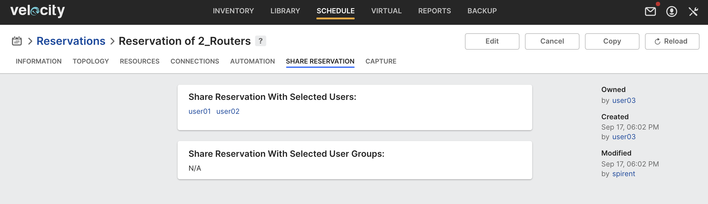

### Project Information:
Project: Automatic Reservation Sharing  
Description: Python reference example triggered automation task for the "On Reservation Created" event in Velocity. When a reservation is created, it is automatically shared with the "user group admin" defined in the script itself, allowing one or more team member to manage the reservation on behalf of the user.  
Category: task  
Class: Community  
  
Upload the project zip that includes the python script and manifest file into Velocity. Set the parameter value for dryrun to false when ready to share the reservation with "user group admins" defined in the script. In this example, adminsForGroup['g2'] = ['user01', 'user02'] means that user01 and user02 are user group admins for a group called g2. The reservation will be automatically be shared with both these users.  
  
  

 ----