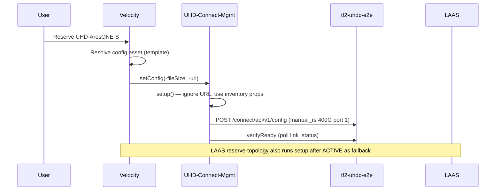

# UHD Connect — RS-FEC on Velocity Reservation

Operational knowledge from bringing **tf2-uhdc-e2e** (UHD Connect) into the **UHD-AresONE-S** topology with automatic **400G manual RS-FEC** on port 1 during reservation.

**Topology path:** `ARESONE-M05/1.1` → OCS `1.1.1` ↔ OCS `6.1.1` → `tf2-uhdc-e2e/1`  
**Wiring reference:** `architect/uhd_ocs_wiring.yaml`  
**Driver:** `Drivers/Community/rp_uhd_connect.mgmt.driver` → Velocity `UHD-Connect-Mgmt` v1.2.3+

---

## Root causes (what blocked automatic FEC)

| Issue | Symptom | Fix |
|-------|---------|-----|
| **Interface mismatch** | Velocity UI: *"Resource and driver interfaces do not match"* | Inventory `CONFIGURABLE` + driver manifest **`Configurable`** (not `Layer 2 Switch`) |
| **No config trigger** | `testCaseExecutions: 0` on UI reserve; FEC never applied | Template **config asset** + device `inheritConfig: true` + topology `useDefaultConfig=true` on UHD resource |
| **LAAS-only hook** | CLI `reserve-topology` worked; UI did not | UI bypasses LAAS; needs Velocity-native `setConfig` path above |
| **Pre-FEC link validation** | `LINK_VALIDATION_FAILED` before reserve | Do not require UHD/AresONE link-up before FEC (inventory OCS wiring only) |
| **External POST /config** | Device `isLocked=true` after curl/LAAS scripts | RS-FEC **only** via driver `setup`/`setConfig` during ACTIVE reservation |

---

## Correct interface pairing

Logical topologies **reject** `LAYER2_SWITCH` on the canvas. Pattern (same as Arista-RoCE-Mgmt):

| Layer | Value |
|-------|--------|
| Inventory template + device | `CONFIGURABLE` |
| Driver `manifest.xml` `<interface>` | **`Configurable`** |
| Velocity catalog | `CONFIGURABLE` |

Mismatch (`CONFIGURABLE` inventory + `Layer 2 Switch` driver) prevents Velocity from invoking `setConfig` on reserve.

---

## Reservation FEC flow (target state)



**Driver `setConfig`** must call `setup()` with **no args** — Velocity passes `-fileSize`/`-url` for the JSON marker asset; L1 values come from inventory properties (`defaultPort`, `linkSpeedGbps`, `fecMode`).

---

## Wiring automation

```bash
cd /root/Apps/LAAS/scripts

# Rebuild topology + attach config asset + CONFIGURABLE inventory
python3 velocity_orchestrate_ai_lab.py build-topology --name UHD-AresONE-S --force

# Upload driver (after manifest changes)
python3 velocity_upload_python_drivers.py --uhd-only --apply
```

Config asset metadata: `architect/uhd_rs_fec_config_asset.json`  
Repository API: `POST /velocity/api/repository/v3/asset` with `name`, `contentType`, `content` (JSON string).

---

## Repair / fallback commands

```bash
# Unblock UHD in Velocity (no RS-FEC)
python3 uhd_velocity_up.py

# Apply FEC on ACTIVE UHD-AresONE-S reservation (UI reserves that missed FEC)
python3 velocity_orchestrate_ai_lab.py uhd-ensure-fec

# LAAS reserve (4h minimum)
python3 velocity_orchestrate_ai_lab.py reserve-topology --name UHD-AresONE-S --hours 4
```

Release: `python3 velocity_orchestrate_ai_lab.py release-reservation --id <uuid>`

---

## Rules (do not break)

1. **Never** `curl`/`POST /config` on UHD outside an ACTIVE reservation — locks device in Velocity.
2. Keep inventory **`CONFIGURABLE`** (not `LAYER2_SWITCH` on logical topology).
3. Keep driver interface **`Configurable`** aligned with inventory.
4. `teardown()` restores pre-reservation config snapshot; empty config after release is expected.
5. `verifyReady` may **timeout** (`link_down`) while FEC is still correctly applied — check `/config` for `manual_rs` on port 1.

---

## IDs (HBG lab)

| Resource | ID / name |
|----------|-----------|
| Device | `tf2-uhdc-e2e` / `cf7fd6c7-737d-405e-8680-9e9d0b2e1fee` |
| Template | `UHD Connect` / `1ddc5167-cff6-4aa0-ba68-cb189de13d2b` |
| Driver | `UHD-Connect-Mgmt` / `deec16db-583e-4740-b471-aec837234244` |
| Config asset | see `architect/uhd_rs_fec_config_asset.json` |

---

## Version history

| Version | Change |
|---------|--------|
| 1.2.0 | `setup`, `verifyReady`, `teardown`, `applyLayer1Profile` |
| 1.2.1 | `setConfig`, `getConfig`, `getVlans` stub |
| 1.2.2 | `setConfig` ignores Velocity fileSize/url args |
| 1.2.3 | Manifest interface **`Configurable`** (fixes UI mismatch) |
